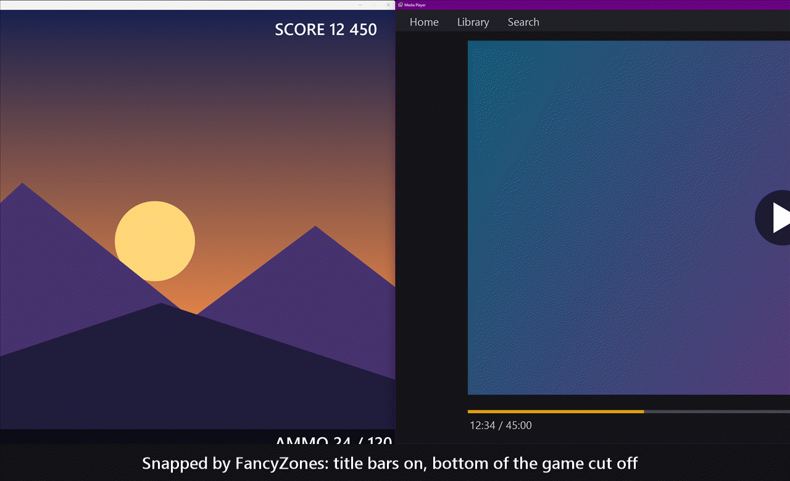

# FancyBorderless

**Borderless windows for FancyZones.** Snap a window into a zone and its title bar disappears, so games, videos and apps use every pixel of their zone.



FancyZones is brilliant at arranging windows, especially on ultrawide monitors. FancyBorderless finishes the job: every window you snap loses its title bar and border and fits its zone exactly. Put a game in windowed mode on one half of the screen and a video on the other, and both look like they were made for the space.

## Highlights

- **Every FancyZones layout works**, your custom layouts as well as the built-in templates, down to the pixel FancyZones uses.
- **Games fit perfectly.** A game running windowed at the zone size gets the entire zone, with nothing cut off at the bottom, and it keeps its resolution when you switch layouts, so the picture is never cropped.
- **Apps fill their zone** and follow along whenever you switch layouts.
- **Stubborn windows are handled too.** Programs that insist on their title bar, or draw their own, get it tucked away above the top edge of the screen.
- **It knows what to leave alone.** Browsers, File Explorer and other apps with tabs or buttons in their title bar keep it by default. Press the hotkey on one and its title bar goes too.
- **One hotkey** (Ctrl+Alt+Shift+T) removes or restores the title bar of any window and remembers your choice for that app.
- **All settings live in the tray menu**, including Start with Windows.
- **Games that run as administrator** are supported with a single setting.
- **It's lightweight**, using around 14 MB of memory and practically no CPU, because it sleeps until something actually happens.
- **It's clean and safe.** No code is ever injected into other programs or games, and every change is undone when you exit.

## Getting started

1. Install [PowerToys](https://github.com/microsoft/PowerToys) and turn on FancyZones.
2. Download `FancyBorderless.exe` from the [latest release](https://github.com/RamazanKara/FancyBorderless/releases/latest) and run it. It lives in the system tray.
3. Snap windows the way you always do: Shift-drag, Win+arrow keys or your layout hotkeys. FancyBorderless takes it from there.
4. Click the tray icon and tick **Start with Windows** to have it ready every time you sign in.

The exe isn't code-signed yet, so Windows SmartScreen may ask the first time you run it. Choose "More info", then "Run anyway", or build it yourself with a single command (see below).

## Tips for games

- Set the game to **Windowed** mode at the size of its zone, for example 2560×1440 for half of a 5120×1440 screen.
- Snap it into its zone once. FancyZones remembers the zone and puts the game back there on every launch ("Move newly created windows to their last known zone" in FancyZones' settings).
- Keep games off FancyZones' excluded apps list, so FancyZones can snap them.
- Use windowed mode rather than borderless or exclusive fullscreen, because FancyZones only snaps windowed games.

### Games that run as administrator

Some games run as administrator, usually because of their anti-cheat. Windows keeps normal programs away from such windows, so FancyZones and FancyBorderless both need administrator mode to work with them:

1. In PowerToys Settings, General tab, turn on **Always run as administrator** ([PowerToys docs](https://learn.microsoft.com/windows/powertoys/administrator)).
2. In FancyBorderless's tray menu, tick **Run as administrator** and confirm the Windows prompt.

With both on, Start with Windows uses a scheduled task, the same way PowerToys does it, so there's no prompt at sign-in. If you press the hotkey on such a game before setting this up, FancyBorderless tells you exactly what to turn on.

## Tray menu

- Remove title bars (turns everything on or off)
- Square corners (turns off Windows 11's rounded corners on borderless windows so they meet the zone edges)
- Start with Windows
- Run as administrator
- Keep title bar for (every snapped app; ticked apps keep their title bar, and clicking one switches it)
- Open settings file, Open log, Exit

A notification confirms every hotkey press, so you always know what happened.

## How it works

FancyBorderless works entirely from the outside, using standard Windows APIs.

- FancyZones marks every window it snaps with a window property (`FancyZones_zones`) holding the zone number. FancyBorderless reads that property to know which windows are snapped and where.
- It reads FancyZones' layout files (`applied-layouts.json`, `custom-layouts.json`) and calculates the zone rectangles with the same integer math FancyZones uses, for custom layouts and built-in templates alike.
- It tells a title bar Windows draws from one an app draws itself by comparing where the window's content starts with where the window starts. For apps that draw their own bar it asks the window what's near the top (`WM_NCHITTEST`, the same question Windows asks to know where a window can be dragged). The answers show where the bar ends and what's in it: a plain title bar answers "caption" across its whole width, while tabs and buttons answer "content".
- It changes windows with `SetWindowLongPtr` and `SetWindowPos`, listens for window events with an out-of-context `SetWinEventHook`, and uses `RegisterHotKey` for its shortcut.
- It marks each window it changes with a property of its own, so even after an unexpected exit the next start recognizes those windows and can restore them.

FancyZones only resizes windows that have a resize border. Once the border is gone FancyZones moves the window on layout changes, and FancyBorderless takes care of the size.

## Lightweight by design

FancyBorderless sleeps until there's something to do. System-wide it only listens for windows appearing and for the end of a mouse drag. Window moves are followed only for the programs whose windows it manages, and Windows notifies it when FancyZones' files change. Moving the mouse never wakes it up, and a quick safety check runs once every five seconds.

On a gaming desktop with several apps snapped it uses about 14 MB of memory and 0.05% of one CPU core while idle.

## Settings file

Everything except the hotkey is in the tray menu. For manual tweaks, the file is at `%APPDATA%\FancyBorderless\config.json`, and changes apply the moment you save it.

| Setting | Default | Meaning |
|---|---|---|
| `removeTitleBars` | `true` | Same as the tray menu item. |
| `squareCorners` | `true` | Same as the tray menu item. |
| `keepTitleBarApps` | `[]` | Apps that keep their title bar, by exe name (`MyApp.exe`; the `.exe` is optional). |
| `removeTitleBarApps` | `[]` | Apps that lose their title bar even when it has tabs or buttons in it. The hotkey and the tray menu edit both lists. |
| `toggleTitleBarHotkey` | `Ctrl+Alt+Shift+T` | Modifiers plus a letter, digit, F1-F24, Numpad0-9 or a named key like `PageUp`. Empty disables it. |
| `runAsAdministrator` | `false` | Same as the tray menu item. |

The log at `%APPDATA%\FancyBorderless\FancyBorderless.log` records every window FancyBorderless changes and why.

## Command line

```
FancyBorderless.exe --list      monitors, calculated zones, snapped windows and their title bars
FancyBorderless.exe --quit      stop the running instance
FancyBorderless.exe --version
```

`--list` gives a quick overview of what FancyBorderless sees: the zones it calculated and the kind of title bar it found on each snapped window.

## Good to know

- Title bars are tucked above the screen in zones along the top of a monitor, which is where most layouts put their main zones. In lower zones, windows that insist on their own title bar keep it.
- It never touches game memory or injects code.
- It has been developed and tested at 100% display scaling. Reports from other scaling levels are very welcome.

## Build from source

Requires Go 1.23 or newer. No other dependencies and no cgo.

```
go build -ldflags "-H=windowsgui -s -w" -o FancyBorderless.exe .
```

## Contributing

Bug reports, ideas and pull requests are welcome. If a window doesn't behave as expected, the output of `FancyBorderless.exe --list` and the relevant lines from the log make it much easier to help.

## License

MIT. See [LICENSE](LICENSE).

FancyBorderless is an independent project and isn't affiliated with or endorsed by Microsoft. FancyZones and PowerToys are Microsoft's.
